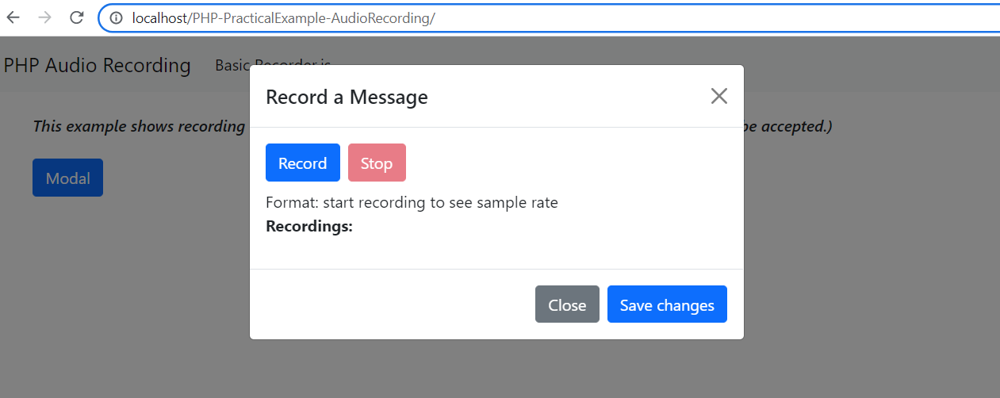

# PHP-PracticalExample-AudioRecording

- This is a practical example using Bootstrap 5 CSS, PHP, JQuery and JQuery Datatables. This is built using basic/native PHP also known Vanilla PHP.
- This is a PHP Web Example.
- This example assumes you already know how to clone, test and deploy your PHP web applications.

## Resources

- **Vanilla PHP** just means plain original PHP without any framework.

- [**Bootstrap 5**](https://getbootstrap.com/docs/5.0/getting-started/introduction/) is the newest version of Bootstrap, which is the most popular HTML, CSS, and JavaScript framework for creating responsive, mobile-first websites.

- [**jQuery**](https://jquery.com/) is a fast, small, and feature-rich JavaScript library. It makes things like HTML document traversal and manipulation, event handling, animation, and Ajax much simpler with an easy-to-use API that works across a multitude of browsers.

- [**Recorder.js**](https://github.com/mattdiamond/Recorderjs) is a plugin for recording/exporting the output of Web Audio API nodes

## Screenshots

## Developer

- [Jerome Soriano](https://github.com/dvxgit-jsoriano)

*"Feel free to read, use, and apply to your projects."*